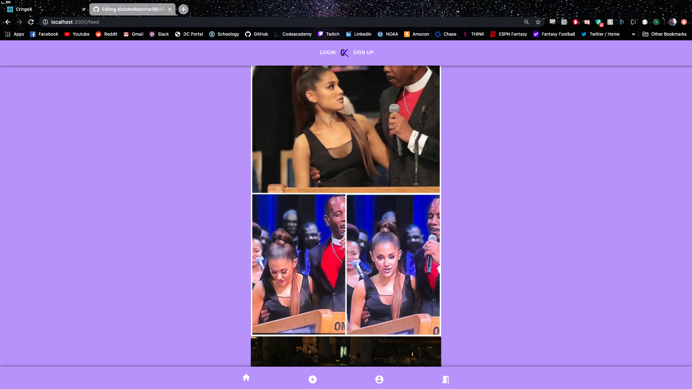

<h1>CringeX Social Media App<h1>

<h2><u>Overview:</u><h2>
<h4>We built a full-stack social media app. CringeX is a hybridized version of Reddit and Tik-Tok centered around cringeworthy content. We allow users to register with us. Then users are able to upload content that will then be displayed into the feed. We also have a page that displays all of the users submissions.</h4>

<ul>
<li>Upvoting and Downvoting posts</li>
<li>Commenting on other users posts</li>
<li>Add a user to friend's list</li>
</ul>

</br>

<h2><u>The Team:</u></h2>

<h3>Jaye Jensen</h3>
<b>Primary team role:</b> Frontend; Styling and JSON Web Tokens
</br>

<h3>Alex Plaetzer</h3>
<b>Primary team role:</b> Frontend; Components and React/Redux Logic
</br>

<h3>Matt Ryan</h3>

<b>Primary team role:</b> Backend; Database and Routes
</br>
</br>
</br>

<h2><u>Technologies used in the project:</u></h3>
<h3>Languages:</h3>
<ul>
    <li>HTML5</li>
    <li>CSS3</li>
    <li>JavaScript</li>
    <li>React</li>
    <li>Redux</li>
    <li>Node</li>
    <li>Express</li>
    <li>ElephantSQL (Hosting)</li>
    <li>PostgresSQL</li>
    <li>API calls</li>
    <li>MaterialUI</li>
    <li>JSON Web Tokens</li>
    <li>Google Firebase</li>

</ul>

Other:

</br>

<h3><u>Base Objectives:</u></h3>
<ul>
    <li>Allow a user to register an account.</li>
    <li>Allow a user to upload content. </li>
    <li>Display a feed of all the content uploaded to the site. </li>
</ul>

</br>

<h2><u>Stretch Goals Future</u></h2>
<ul>
<li>Upvoting and Downvoting posts</li>
<li>Commenting on other users posts</li>
<li>Add a user to friend's list</li>
</ul>

</br>

<h2><u>Challenges & Solutions:</u><h2>
<h3>Some of the biggest challenges we faced with this project build included:</h2>

<b>Challenge: Uploading conent and then pulling it out of a database.</b>
<br>
<b>Solution: We used an ElephantSQL database to store user and post information and Google Firebase to store the image and it's pathway, we then used an API call to the server to retrive that information and render it on the page.</b>

</br>

<h2><u>Code Snippets:</u></h2>

<h4>This is our logic for uploading to both firebase and our database at the same time.</h4>

```
 handleUpload = (event) => {
    event.preventDefault();
    console.log("handle upload button called");

    const { image } = this.state;
    const uploadTask = storage.ref(`images/${image.name}`).put(image);
    uploadTask.on(
      "state_changed",
      (snapshot) => {
        console.log("Taking snapshot...");
        // progress function ...
        const progress = Math.round(
          (snapshot.bytesTransferred / snapshot.totalBytes) * 100
        );
        this.setState({ progress });
      },
      (error) => {
        // Error function ...
        console.log(error);
      },
      () => {
        // complete function ...
        console.log("Saving to storage...");

        console.log(image);
        console.log(image.name);
        storage
          .ref("images")
          .child(image.name)
          .getDownloadURL()
          .then((url) => {
            this.setState({ url: url });
            //make api call here to post information back to the server
            console.log("Posting to server...");
            console.log(this.state.url);
            let type = "";
            // let media = this.state.url.split(".");
            let firebaseURL = this.state.url;
            let splitURL = firebaseURL.split("?");
            let splitPeriod = splitURL[0];
            let media = splitPeriod.split(".");
            console.log("Testing split URL");
            console.log(splitPeriod);
            console.log(media);
            console.log(media[media.length - 1]);

            switch (media[media.length - 1]) {
              case "jpg" || "png" || "jpeg" || "gif":
                type = "image";
                break;
              case "mp4" || "mp5" || "flv" || "mpeg":
                type = "video";
                break;
              default:
                console.log("UNSUPPORTED FILE TYPE");
                break;
            }
            console.log(type);
            console.log(this.state.url);
            // console.log(this.state.caption);

            let apiPayload = {
              videoUrl: this.state.url,
              postType: type,
              caption: this.state.caption,
            };

            axios.post("/upload", apiPayload).then((response) => {
              console.log(response);
              console.log("information submitted to database");
            });
          });
      }
    );
  };

```

<br/>

<h4>This snippet shows our logic for the upload on the backend.</h4>

```
router.post("/upload", auth, (req, res) => {
  let user = req.user.id;
  let url = req.body.videoUrl;
  let postType = req.body.postType;
  let caption = req.body.caption;

  console.log(user);
  console.log(url);
  console.log(typeof user);
  console.log(typeof url);
  console.log(req.body.videoUrl);

  console.log("Trying to find content type in this world that we live in");
  console.log(req.body);
  console.log(req.body.postType);

  let post = db.videos.build({
    userId: user,
    videoUrl: url,
    contentType: postType,
    caption: caption,
  });

  console.log("Building the post with the following");
  console.log(post);

  post
    .save()
    .then(() => {
      console.log("Saving post to database...");
      res.sendStatus(200);
    })
    .catch((err) => {
      console.error(err);
    });
});

module.exports = router;

```

</br>

<h2>Screenshots:</h2>

<h4>Login.</h4>
<br />

<h4>Upload.</h4>
<br />

<h4>Feed.</h4>
